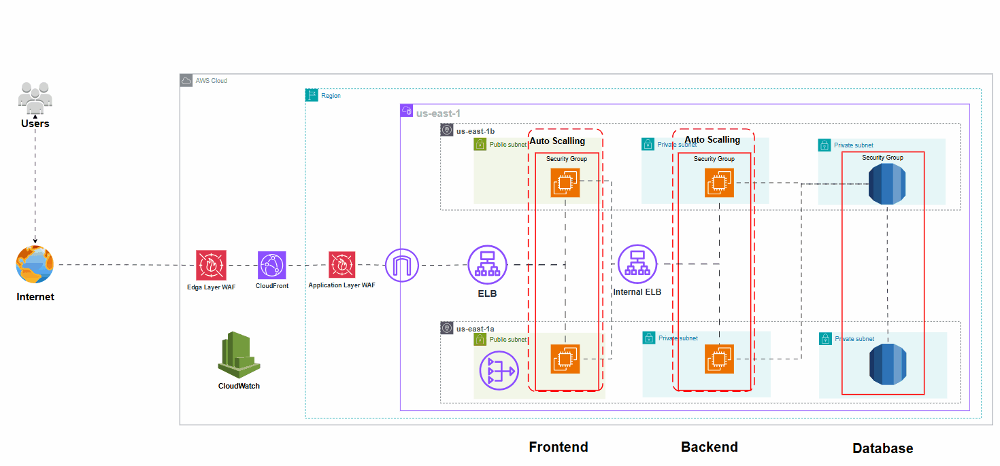

# 🏗️ 3‑Tier Web Application on AWS

## Table of Contents 📘

- [Solution Overview](#solution-overview)  
- [Architecture Diagram](#architecture-diagram)  
- [Components](#components)  
  - [Networking 🚦](#networking)  
  - [Security 🔒](#security)  
  - [Frontend Tier 🌐](#frontend-tier)  
  - [Backend Tier ⚙️](#backend-tier)  
  - [Database Tier 🗄️](#database-tier)  
  - [Monitoring & Logging 📊](#monitoring--logging)  
- [Manual Deployment Steps](#manual-deployment-steps)  
- [Use Cases & Benefits](#use-cases--benefits)  
- [Customization](#customization)  
- [Cleanup 🧹](#cleanup)

---

## Solution Overview ✨

This repository illustrates how to manually provision a **highly available**, **scalable**, and **secure 3‑tier web application** on AWS using the AWS Console or CLI.  
Ideal for hands-on learning, audit transparency, or environments where scripted automation isn’t used.

---

## Architecture Diagram 🖼️

Below is the high-level architecture deployed across two Availability Zones:

---

## Components ⚙️

### Networking 🚦
- VPC with two **public** and two **private** subnets  
- **Internet Gateway** for inbound traffic  
- **NAT Gateways** (one per AZ) for private-tier internet access  
  - ⚠️ **Important:** Each **public NAT Gateway** requires an **Elastic IP (EIP)** to function—this ensures a static, routable IP address for outbound traffic  [oai_citation:0‡docs.aws.amazon.com](https://docs.aws.amazon.com/vpc/latest/userguide/vpc-nat-gateway.html?utm_source=chatgpt.com) [oai_citation:1‡serverfault.com](https://serverfault.com/questions/958663/aws-nat-gateway-using-a-non-elastic-ip-address?utm_source=chatgpt.com) [oai_citation:2‡stackoverflow.com](https://stackoverflow.com/questions/43094786/why-does-a-aws-nat-gateway-require-an-elasticip?utm_source=chatgpt.com) [oai_citation:3‡docs.aws.amazon.com](https://docs.aws.amazon.com/vpc/latest/userguide/nat-gateway-scenarios.html?utm_source=chatgpt.com)  
- Custom **Route Tables** ensuring proper routing

### Security 🔒
- Security groups for frontend, backend, and database tiers  
- WAF protection at both edge and application layers  
- IAM roles assigned to EC2 instances for least-privilege operations

### Frontend Tier 🌐
- EC2 instances (running NGINX) in public subnets  
- Auto Scaling Group for dynamic scaling  
- Internet-facing Load Balancer distributes user traffic  
- CloudFront provides caching, edge delivery, and DDoS protection

### Backend Tier ⚙️
- EC2 application/API servers in private subnets  
- Internal Load Balancer manages inter-service traffic  
- Secure and private communication with frontend and database tiers

### Database Tier 🗄️
- Amazon RDS (PostgreSQL/MySQL) in Multi‑AZ private subnets  
- Automated backups, snapshots, and failover functionality  
- Database access restricted only to backend tier

### Monitoring & Logging 📊
- Amazon CloudWatch collects metrics and logs  
- Alarms alert on unhealthy instances or threshold breaches  
- Optional SNS integration for notifications

---

## Manual Deployment Steps 📋

1. **Network Setup** 🚧  
2. **Security Configuration** 🔐  
3. **Deploy Frontend** 🌐  
4. **Deploy Backend** ⚙️  
5. **Provision Database** 🗄️  
6. **Enable Monitoring** 📈

---

## Use Cases & Benefits 💡

- Hands-on AWS infrastructure learning  
- Audit-friendly manual provisioning  
- Production-grade template for web/API apps  
- Cost-effective, using AWS free-tier resources

---

## Customization 🔧

- Swap EC2 backend for ECS or EKS  
- Add caching layer with Redis or Memcached  
- Introduce CI/CD pipelines (CodeDeploy, CodePipeline, etc.)  
- Export this setup to CloudFormation  
- Enhance with VPC Flow Logs, advanced dashboards, or X-Ray

---

## Cleanup 🧹

1. Delete CloudFront distribution  
2. Tear down load balancers (frontend & backend)  
3. Remove EC2 Auto Scaling Groups and templates  
4. Delete RDS instance  
5. Remove NAT Gateways, route tables, and VPC  
6. Clean up CloudWatch logs and alarms